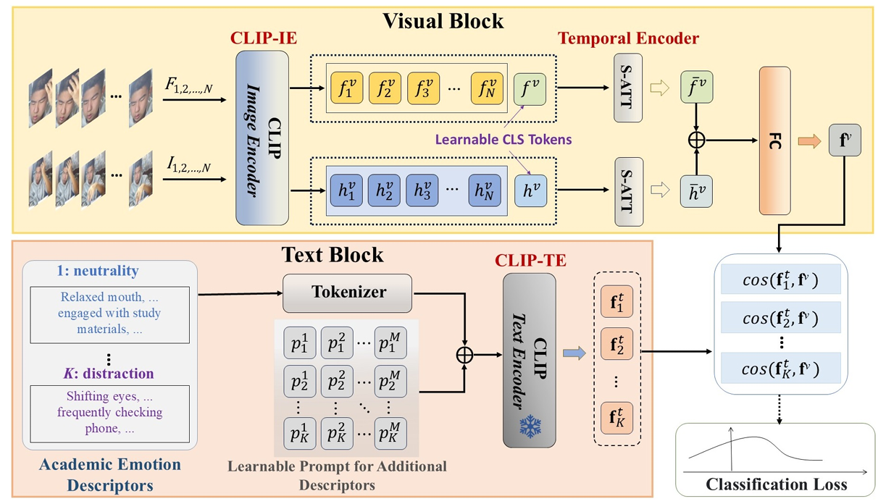

# CLIP-based Context-aware Academic Emotion Recognition

This repo is the official implementation for CLIP-based Context-aware Academic Emotion Recognition[[arXiv](https://arxiv.org/abs/2507.00586)]. The paper has been accepted to ICCV 2025.

## Introduction
In this paper, we propose CLIP-CAER, a context-aware academic emotion recognition method based on CLIP. By leveraging contextual information from learning scenarios, our method significantly improves the model’s ability to recognize students’ learning states (i.e., focused or distracted). Notably, it achieves an approximately 20% improvement in accuracy for the distraction category.<br>
Our framework, similar to the vision-language model CLIP, primarily consists of two components: a text block and a visual block. In the text block, for each academic emotion category, a fixed text is pre-generated to describe the associated facial expressions and learning contexts, complemented by a learnable text prompt to capture additional relevant details during training. Subsequently, by inputting the fixed text and the learnable text prompt together into the CLIP text encoder, we obtain a text feature token for each emotion category. Given an input video, the visual block uses the CLIP image encoder to separately extract facial expression features and context features from each video frame. These visual features are then processed through a temporal encoder module to capture their sequential relationships, resulting in a visual feature token that effectively represents both the facial expression and context information within the video. Given the aligned visual and text feature spaces in the pre-trained CLIP model, we classify the input video by calculating the similarity between its visual feature token and the text feature tokens for each academic emotion category.

## Weights Download

We provide the model weights trained by the method in this paper, which can be downloaded [here](https://drive.google.com/file/d/1mNYBKJ-vlsGf1QTN0tySs0-7sp-f7flb/view?usp=sharing).

## Performance

## Visualizations


## Environment

The code is developed and tested under the following environment:

- Python 3.8

- PyTorch 2.2.2

- CUDA 12.4

```bash
conda create -n clip-caer python=3.8
conda activate clip-caer
pip install torch==2.2.2 torchvision==0.17.2 torchaudio==2.2.2 --index-url https://download.pytorch.org/whl/cu121
```

## Usage

### Training
```bash
bash train.sh
```

### Evaluation
```bash
bash valid.sh
```

## Citations

If you find our paper useful in your research, please consider citing:

```bash
@InProceedings{Zhao_2025_ICCV,
    author    = {Zhao, Luming and Xuan, Jingwen and Lou, Jiamin and Yu, Yonghui and Yang, Wenwu},
    title     = {Context-Aware Academic Emotion Dataset and Benchmark},
    booktitle = {Proceedings of the IEEE/CVF International Conference on Computer Vision (ICCV)},
    year      = {2025}
}
```

## Acknowledgment
Our codes are mainly based on [DFER-CLIP](https://github.com/zengqunzhao/DFER-CLIP/tree/main). Many thanks to the authors!
