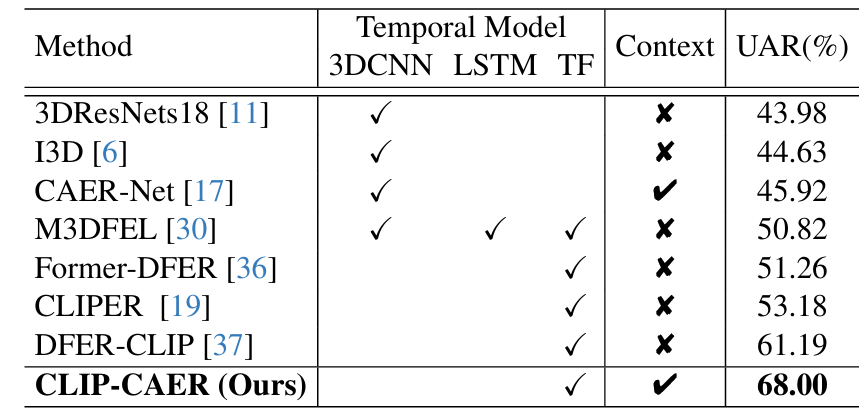
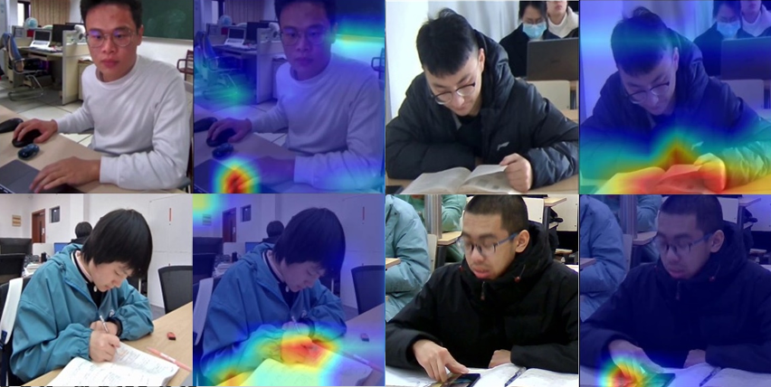

# CLIP-based Context-aware Academic Emotion Recognition

This repo is the official implementation for CLIP-based Context-aware Academic Emotion Recognition[[arixv](https://arxiv.org/abs/2507.00586)]. The paper has been accepted to ICCV 2025.

## Introduction

to be added.

## Weights Download

We provide the model weights trained by the method in this paper, which can be downloaded [here]().

## Performance



## Visualizations



## Environment

The code is developed and tested under the following environment:

to be update

- Python 3.8

- PyTorch 2.2.2

- CUDA 12.4

```bash
conda create -n clip-caer python=3.8
conda activate clip-caer
pip install torch==2.2.2 torchvision==0.17.2 torchaudio==2.2.2 --index-url https://download.pytorch.org/whl/cu121
pip install -r requirements.txt
```

## Usage

### Training

```bash
bash train.sh
```

### Evaluation

```bash
bash valid.sh
```

## Citations

If you find our paper useful in your research, please consider citing:

```bash
@InProceedings{Zhao_2025_ICCV,
    author    = {Zhao, Luming and Xuan, Jingwen and Lou, Jiamin and Yu, Yonghui and Yang, Wenwu},
    title     = {Context-Aware Academic Emotion Dataset and Benchmark},
    booktitle = {Proceedings of the IEEE/CVF International Conference on Computer Vision (ICCV)},
    year      = {2025}
}
```

## Acknowledgment

Our codes are mainly based on [DFER-CLIP](https://github.com/zengqunzhao/DFER-CLIP/tree/main). Many thanks to the authors!
